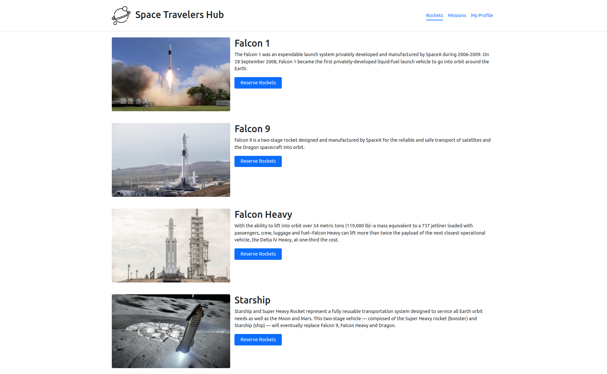

# Space Travelers Hub

## Built With

- React (CRA)
- React Router Dom
- Redux Toolkit
- Bootstrap

## sneak peek

## Getting Started

**Prerequisites:** A Web Browser (preferably FireFox or Chrome)
To get a local copy up and running follow these simple exampl

#### Live demo

[Space Travelers Hub](http://ridwanediallo.github.io/Space-travelers--hub)

### **Option 2**

#### Set up your own copy locally

- Clone [the GitHub Repository](https://github.com/ridwanediallo/Space-travelers--hub.git)
- Go to the Project `cd "Space-travelers--hub"`
- Run `npm install` to install the _dependencies_
- Run `npm start` to run the live server.
- Run `npm test` to run the tests.

## About us

👤 **Ridwan**

- GitHub: [@githubridwan](https://github.com/ridwanediallo)
- Twitter: [@twitterridwan](https://twitter.com/RidwaneD)
- LinkedIn: [LinkedIn](https://www.linkedin.com/in/ridwan-diallo-9a1634193)

👤 **Saningo**

- GitHub: [@githubsaningo](https://github.com/sainingo)
- Twitter: [@twittersaningo](https://twitter.com/saningoInn)
- LinkedIn: [LinkedIn](https://www.linkedin.com/in/saningo/)

## Contributors

Contributions, issues, and feature requests are welcome!

Feel free to check the [issues page](../../issues/).

## Show your support

Give a ⭐️ if you like this project!

## 📝 License

This project is under the [MIT](LICENSE) license.
